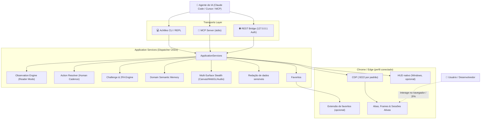

# Achilles CDP Agent

<p align="center">
  <pre align="center">
 ▄▄▄       ▄████▄   ██░ ██  ██▓ ██▓     ██▓    ▓█████   ██████ 
▒████▄    ▒██▀ ▀█  ▓██░ ██▒▓██▒▓██▒    ▓██▒    ▓█   ▀ ▒██    ▒ 
▒██  ▀█▄  ▒▓█    ▄ ▒██▀▀██░▒██▒▒██░    ▒██░    ▒███   ░ ▓██▄   
░██▄▄▄▄██ ▒▓▓▄ ▄██▒░▓█ ░██ ░██░▒██░    ▒██░    ▒▓█  ▄   ▒   ██▒
 ▓█   ▓██▒▒ ▓███▀ ░░▓█▒░██▓░██░░██████▒░██████▒░▒████▒▒██████▒▒
 ▒▒   ▓▒█░░ ░▒ ▒  ░ ▒ ░░▒░▒░▓  ░ ▒░▓  ░░ ▒░▓  ░░░ ▒░ ░▒ ▒▓▒ ▒ ░
  </pre>
</p>

<p align="center">
  <strong>Automação e observação de Chrome e Edge para agentes locais.</strong><br>
  <em>CLI • MCP stdio • REST local • Reader Mode • relatórios de sessão</em>
</p>

<p align="center">
  <a href="https://github.com/PedroReoli/Achilles-CDP-Agent/actions/workflows/ci.yml"></a>
  <a href="#-instalação-rápida"></a>
  <a href="LICENSE"></a>
</p>

---

## 💡 O que é o Achilles?

O **Achilles CDP Agent** conecta agentes locais a uma sessão de Chrome, Chromium ou Edge exposta pelo **Chrome DevTools Protocol (CDP)**. CLI, servidor MCP stdio e REST local compartilham o mesmo catálogo de operações.

O motor usa Playwright conectado por CDP para ações em páginas e chamadas CDP diretas para parte da observação. Pode iniciar um perfil persistente próprio se a porta estiver fechada. Navegação, login e resolução de desafios podem ocorrer com intervenção humana. Favoritos exigem uma extensão instalada no perfil controlado.

---

## ⚡ Principais Recursos

### 1. 📖 Observação compacta
* `browser_snapshot` resume elementos interativos, frames e Shadow DOM aberto; o modo rápido é o padrão no MCP e REST.
* `browser_read_content` extrai o conteúdo principal em Markdown e elimina parte do ruído do HTML.
* O ganho de tamanho depende da página. O [benchmark reproduzível](.docs/benchmark.md) informa p50/p95 e uma **estimativa** de tokens para uma fixture local.

### 2. 🛡️ Ajustes de navegador e ações
* Scripts de inicialização ajustam sinais de `navigator`, Canvas, WebGL e áudio nas páginas conectadas.
* Ações usam Locators do Playwright, com identificação por snapshot, verificação posterior e digitação sequencial.
* Esses ajustes não garantem invisibilidade nem resolução automática de bloqueios anti-bot.

### 3. 🔮 HUD opcional no Windows
* O HUD nativo mostra estados como `idle`, `acting` e `waiting_human` fora do DOM da página.
* A disponibilidade e o posicionamento dependem da janela e da plataforma; a automação não depende do HUD.

### 4. 🤝 Challenge & 2FA Handshake Engine
* Sinaliza padrões conhecidos de CAPTCHA, WAF, login e 2FA/OTP.
* Aguarda a resolução humana e registra o estado observado; não contorna esses mecanismos.

### 5. 🔒 Redação de dados sensíveis
* Resultados e relatórios aplicam regras de redação para classes conhecidas de tokens, credenciais e parâmetros de URL.
* A redação é uma proteção de melhor esforço. Revise saídas antes de enviá-las a modelos ou terceiros e prefira um perfil dedicado.

### 6. 🧠 Domain Semantic Route Memory
* Cache persistente em disco (`%LOCALAPPDATA%\Achilles\domain_memory.json`) que mapeia estados autenticados, atalhos de rotas (`/profile`, `/billing`) e APIs descobertas por domínio.

### 7. 📊 Relatório da sessão
* Exporta HTML standalone com timeline de operações, histórico HTTP redigido, desafios observados e métricas de tamanho estimadas.

### 8. ⭐ Favoritos do navegador
* Lista, busca, cria, edita e remove favoritos pelo `chrome.bookmarks` em uma extensão mínima para Chrome/Edge. Veja o [guia de instalação](.docs/browser-bookmarks.md).

---

## 🏗️ Arquitetura do Sistema



---

## 🚀 Instalação Rápida

Requer Python 3.9+ e Chrome, Chromium ou Edge com endpoint CDP local. O Achilles tenta iniciar Chrome quando a porta está fechada; `ACHILLES_BROWSER=edge` seleciona Edge. O perfil iniciado automaticamente é separado do perfil pessoal. Para usar favoritos, instale a [extensão no perfil conectado](.docs/browser-bookmarks.md).

### Windows (PowerShell)
```powershell
git clone https://github.com/PedroReoli/Achilles-CDP-Agent.git
cd Achilles-CDP-Agent
python -m venv .venv
.\.venv\Scripts\python.exe -m pip install -e .
.\.venv\Scripts\python.exe -m achilles doctor
```

### Linux / macOS
```bash
git clone https://github.com/PedroReoli/Achilles-CDP-Agent.git
cd Achilles-CDP-Agent
python3 -m venv .venv
./.venv/bin/python -m pip install -e .
./.venv/bin/python -m achilles doctor
```

`install.bat` e `install.sh` também instalam a partir do checkout atual. Para executar testes de integração, instale `.[test]` e `python -m playwright install chromium` no mesmo ambiente virtual.

---

## 🔌 Integração MCP (Claude Code, Cursor, Windsurf)

Adicione o Achilles no arquivo de configuração do seu cliente MCP (`claude_desktop_config.json` ou `mcp.json`):

```json
{
  "mcpServers": {
    "achilles": {
      "command": "achilles",
      "args": ["mcp", "--cdp-port", "9222"]
    }
  }
}
```

O catálogo atual inclui ferramentas para páginas, rede, relatórios, segurança e favoritos. Exemplos:
* `browser_read_content`: Extrai o conteúdo principal em Markdown.
* `browser_snapshot`: Resume elementos interativos, frames e Shadow DOM aberto.
* `browser_action`: Executa cliques, preenchimentos com cadência humana, hover e teclas.
* `browser_wait_for_challenge`: Aguarda resolução humana de CAPTCHA/2FA.
* `browser_domain_memory`: Consulta e armazena memória de rotas por domínio.
* `browser_export_html_report`: Exporta relatório da sessão em HTML.
* `browser_bookmarks_*`: Lista, busca, cria, edita e remove favoritos do perfil conectado.
* `security_audit`: Auditoria de postura passiva e cabeçalhos OWASP.

O servidor MCP usa stdio e mantém o stdout reservado a JSON-RPC. `browser_status` e `tools/list` não iniciam o navegador; ferramentas que precisam dele tentam conectar ou iniciar o perfil configurado. Respostas extensas são limitadas como JSON válido. Veja [contratos, versões e limites](.docs/application-services.md).

`browser_snapshot` usa o caminho rápido por padrão nos transportes MCP/REST (`fast=true`), com nomes e papéis derivados do DOM, incluindo frames e Shadow DOM aberto. Use `fast=false` quando precisar dos nomes da árvore de acessibilidade do Chrome; esse modo faz mais chamadas CDP. Os tempos dependem da página, dos frames e do estado da conexão, portanto 100 ms não é um limite garantido.

### Favoritos do Chrome e Edge

O Achilles lista, busca, cria, edita e remove favoritos do perfil conectado pela API oficial de extensões. A extensão mínima `Achilles Browser Bridge` solicita somente a permissão de favoritos. `achilles --extension` gera um ZIP e uma pasta pronta para instalar na Área de Trabalho, com instruções por notificação e no terminal. A instalação no navegador é manual. Veja [instalação, comandos e limites](.docs/browser-bookmarks.md). Exemplo: `achilles bookmarks search "Achilles"`.

---

## 💻 Comandos da Linha de Comando (CLI Cheat Sheet)

| Comando | Descrição |
|---|---|
| `achilles` ou `achilles interactive` | Inicia o console REPL interativo com visual dark-mode e banner |
| `achilles open <url>` | Abre ou navega uma aba do Chrome para a URL informada |
| `achilles status` | Exibe métricas de sessão e porta CDP |
| `achilles bookmarks list` | Lista pastas de favoritos do Chrome/Edge conectado |
| `achilles --extension` | Prepara ZIP e pasta da extensão na Área de Trabalho e mostra as instruções |
| `achilles read` | Extrai o conteúdo principal em Markdown |
| `achilles snapshot --limit 50` | Lista elementos interativos `[@ref]` visíveis no viewport |
| `achilles act click <ref>` | Executa clique em um elemento pelo seu ID de referência ou índice |
| `achilles act fill <ref> "<texto>"` | Digita texto com cadência humana |
| `achilles act scroll <down\|up> [px]` | Rola a página suavemente na direção informada |
| `achilles curl <request_id>` | Gera comando cURL reproduzível com redação de segredos |
| `achilles wait-challenge` | Aguarda o usuário resolver Cloudflare, CAPTCHA ou 2FA |
| `achilles memory [dominio]` | Consulta atalhos e memórias de rotas do domínio |
| `achilles export-report` | Gera HTML standalone com timeline, estimativa de tokens, desafios e histórico HTTP da sessão ativa |
| `achilles doctor` | Valida dependências e handshake MCP; informa separadamente se a porta CDP está fechada |
| `achilles audit` | Executa auditoria passiva de segurança e headers OWASP |
| `achilles traffic` | Exibe exchanges HTTP capturados com dados sensíveis mascarados |
| `achilles start --port 8765` | Inicia a REST API local com autenticação Bearer |
| `achilles mcp` | Inicia o servidor MCP via stdio |
| `achilles --ai` | Exibe o protocolo autônomo com diretrizes para agentes de IA |

---

## 🧪 Testes Automatizados

O projeto conta com testes unitários/de contrato e integração com perfis descartáveis de Chromium. O teste de Edge é opcional (`ACHILLES_EDGE_TESTS=1`) e requer Edge instalado:

```powershell
# Executa os testes unitários e de contrato
python -m unittest discover tests -v

# Instala o navegador de teste antes da integração
python -m playwright install chromium

# Executa testes de integração com perfil descartável
$env:ACHILLES_BROWSER_TESTS = '1'
python -m unittest discover -s tests -p test_browser_integration.py -v

# Executa o benchmark local e grava JSON reproduzível
python scripts/benchmark.py --samples 20 --elements 50 --output benchmark.json
```

O benchmark mede partida do Chromium, conexão CDP e p50/p95 aquecidos de `snapshot`, `read` e clique. A comparação de tokens usa a aproximação de quatro caracteres por token, sem tokenizer de LLM. Veja [método e limites](.docs/benchmark.md).

---

## 🤝 Contribuição e segurança

Leia o [guia de contribuição](CONTRIBUTING.md), o [histórico de mudanças](CHANGELOG.md) e a [política de segurança](SECURITY.md). Use GitHub Security Advisories para reportar vulnerabilidades de forma privada.

---

## 📄 Licença

Distribuído sob a licença **MIT**. Consulte o arquivo [LICENSE](LICENSE) para obter mais informações.

Mantido por **Pedro Lucas Reis** / **Reoli Open Source**.
