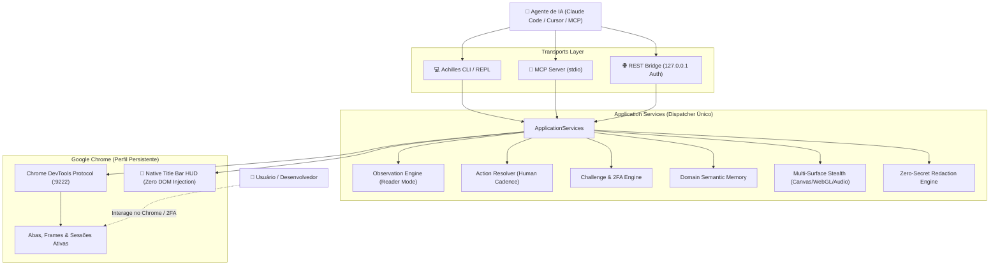

# Achilles CDP Agent v2.1

<p align="center">
  <pre align="center">
 ▄▄▄       ▄████▄   ██░ ██  ██▓ ██▓     ██▓    ▓█████   ██████ 
▒████▄    ▒██▀ ▀█  ▓██░ ██▒▓██▒▓██▒    ▓██▒    ▓█   ▀ ▒██    ▒ 
▒██  ▀█▄  ▒▓█    ▄ ▒██▀▀██░▒██▒▒██░    ▒██░    ▒███   ░ ▓██▄   
░██▄▄▄▄██ ▒▓▓▄ ▄██▒░▓█ ░██ ░██░▒██░    ▒██░    ▒▓█  ▄   ▒   ██▒
 ▓█   ▓██▒▒ ▓███▀ ░░▓█▒░██▓░██░░██████▒░██████▒░▒████▒▒██████▒▒
 ▒▒   ▓▒█░░ ░▒ ▒  ░ ▒ ░░▒░▒░▓  ░ ▒░▓  ░░ ▒░▓  ░░░ ▒░ ░▒ ▒▓▒ ▒ ░
  </pre>
</p>

<p align="center">
  <strong>O motor universal de navegação autônoma e colaborativa no Chrome para Agentes de IA.</strong><br>
  <em>Multi-Surface Anti-Bot Stealth • Native Title Bar HUD (Zero DOM Injection) • ~95% Economia de Tokens • Zero Secret Leakage • MCP Nativo</em>
</p>

<p align="center">
  <a href="#-principais-recursos"></a>
  <a href="#-testes-automatizados"></a>
  <a href="#-integração-mcp"></a>
  <a href="#-multi-surface-stealth"></a>
  <a href="LICENSE"></a>
</p>

---

## 💡 O que é o Achilles?

O **Achilles CDP Agent** conecta agentes de inteligência artificial (como Claude Code, Gemini CLI, Cursor, Windsurf ou scripts autônomos) a uma instância real do Google Chrome via **Chrome DevTools Protocol (CDP)**.

Diferente de frameworks tradicionais que tentam substituir o navegador por instâncias descartáveis e fáceis de detectar, o Achilles adota uma **filosofia colaborativa**: ele utiliza um perfil de usuário persistente, protege a identidade do navegador contra bloqueios anti-bot em múltiplas superfícies (Canvas, WebGL, Áudio) e trabalha junto com o usuário através de um **HUD nativo fixado na barra de título do Chrome**.

---

## ⚡ Principais Recursos

### 1. 📖 Reader Mode & Token-Zero-Waste (~95% de Economia)
* Elimina nós ruidosos (`<script>`, `<style>`, `<nav>`, anúncios, banners de cookies, SVGs).
* Extrai o miolo semântico da página em Markdown limpo estruturado (`h1`-`h6`, parágrafos, listas, tabelas, links).
* **Economia real de 95% a 98% dos tokens** por página em comparação ao HTML bruto.

### 2. 🛡️ Multi-Surface Stealth (Zero-Detection Anti-Bot)
* **Chrome Nativo Genuíno**: Inicialização limpa sem sinalizadores de linha de comando que disparam infobars de aviso (`AutomationControlled`).
* **Navigator Webdriver**: Mascarado nativamente como `undefined` em todos os contextos e frames.
* **Canvas 2D**: Injeção de micro-ruído imperceptível de pixel em `getImageData` que invalida hashes de canvas fingerprinting.
* **WebGL Spoofing**: Simulação de GPU autêntica NVIDIA GeForce RTX 3060 via `WEBGL_debug_renderer_info`.
* **Web Audio API Jitter**: Micro-ruído acústico em `AudioBuffer.getChannelData`.
* **Cadência Humana**: Digitação sequencial (`press_sequentially`) com ritmo e delays naturais em inputs.

### 3. 🔮 Native Title Bar HUD Overlay (Zero DOM Injection)
* Ancorado fora da página web, **diretamente na barra de título do Chrome**, ao lado dos botões do Windows (`_` `□` `✕`).
* **Zero Footprint no DOM**: Nenhum elemento HTML, script ou host CSS é inserido nas páginas visitadas. Scripts anti-bot e sites bancários não conseguem detectar a presença do agente.
* Sincronização automática com a posição e estado da janela do Chrome (minimizar, mover, restaurar).
* Pill moderna com visual glassmórfico escuro exibindo o status em tempo real:
  - 🟢 **`idle`**: Agente pronto para cooperar.
  - 🟣 **`acting`**: Agente clicando, digitando ou navegando.
  - 🟡 **`waiting_human`**: Agente aguardando você resolver um desafio ou login.

### 4. 🤝 Challenge & 2FA Handshake Engine
* Detecção proativa de **Cloudflare Turnstile**, **Google reCAPTCHA**, **hCaptcha**, **Arkose Labs**, **AWS WAF**, telas de **2FA/OTP** e barreiras de login.
* O agente pausa e aguarda o usuário humano resolver a barreira no navegador. Assim que a barreira é resolvida ou há navegação, o controle é devolvido automaticamente ao agente.

### 5. 🔒 Zero Secret Leakage (Privacidade Absoluta)
* Engine de redação profunda que mascara senhas, Bearer tokens, JWTs, chaves de API (OpenAI, Anthropic, AWS, Stripe, GitHub, Slack) e cookies como `[REDACTED]`.
* Dados sensíveis **NUNCA entram no prompt da LLM** nem nos logs de tráfego.

### 6. 🧠 Domain Semantic Route Memory
* Cache persistente em disco (`%LOCALAPPDATA%\Achilles\domain_memory.json`) que mapeia estados autenticados, atalhos de rotas (`/profile`, `/billing`) e APIs descobertas por domínio.

### 7. 📊 Dashboard HTML Standalone
* Gera relatório executivo visual da sessão em arquivo HTML único, responsivo e em dark-mode com glassmorphism, sem nenhuma dependência externa de CDN.

---

## 🏗️ Arquitetura do Sistema



---

## 🚀 Instalação Rápida

### Windows (Automático)
```powershell
git clone https://github.com/PedroReoli/Achilles-CDP-Agent.git
cd Achilles-CDP-Agent
.\install.bat
```

### Linux / macOS
```bash
git clone https://github.com/PedroReoli/Achilles-CDP-Agent.git
cd Achilles-CDP-Agent
chmod +x install.sh
./install.sh
```

### Manualmente via Pip
```bash
python -m pip install -e ".[test]"
```

---

## 🔌 Integração MCP (Claude Code, Cursor, Windsurf)

Adicione o Achilles no arquivo de configuração do seu cliente MCP (`claude_desktop_config.json` ou `mcp.json`):

```json
{
  "mcpServers": {
    "achilles": {
      "command": "achilles",
      "args": ["mcp", "--cdp-port", "9222"]
    }
  }
}
```

O Achilles disponibilizará automaticamente 17 ferramentas padronizadas para a sua IA:
* `browser_read_content`: Lê páginas em Reader Mode (~95% economia de tokens).
* `browser_snapshot`: Captura linear de elementos interativos visíveis no viewport.
* `browser_action`: Executa cliques, preenchimentos com cadência humana, hover e teclas.
* `browser_wait_for_challenge`: Aguarda resolução colaborativa humana de CAPTCHA/2FA.
* `browser_domain_memory`: Consulta e armazena memória de rotas por domínio.
* `browser_export_html_report`: Exporta relatório executivo em dashboard HTML.
* `security_audit`: Auditoria de postura passiva e cabeçalhos OWASP.

---

## 💻 Comandos da Linha de Comando (CLI Cheat Sheet)

| Comando | Descrição |
|---|---|
| `achilles` ou `achilles interactive` | Inicia o console REPL interativo com visual dark-mode e banner |
| `achilles open <url>` | Abre ou navega uma aba do Chrome para a URL informada |
| `achilles status` | Exibe métricas de sessão, porta CDP e status do Chrome |
| `achilles read` | Extrai o conteúdo em Markdown limpo (Reader Mode, ~95% economia de tokens) |
| `achilles snapshot --limit 50` | Lista elementos interativos `[@ref]` visíveis no viewport |
| `achilles act click <ref>` | Executa clique em um elemento pelo seu ID de referência ou índice |
| `achilles act fill <ref> "<texto>"` | Digita texto com cadência humana |
| `achilles act scroll <down\|up> [px]` | Rola a página suavemente na direção informada |
| `achilles curl <request_id>` | Gera comando cURL reproduzível com redação de segredos |
| `achilles wait-challenge` | Aguarda o usuário resolver Cloudflare, CAPTCHA ou 2FA |
| `achilles memory [dominio]` | Consulta atalhos e memórias de rotas do domínio |
| `achilles export-report` | Gera dashboard HTML executivo da sessão |
| `achilles audit` | Executa auditoria passiva de segurança e headers OWASP |
| `achilles traffic` | Exibe exchanges HTTP capturados com dados sensíveis mascarados |
| `achilles start --port 8765` | Inicia a REST API local com autenticação Bearer HMAC |
| `achilles mcp` | Inicia o servidor MCP via stdio |
| `achilles --ai` | Exibe o protocolo autônomo com diretrizes para agentes de IA |

---

## 🧪 Testes Automatizados

O projeto conta com suíte de testes unitários e de integração de ponta a ponta com o Chromium:

```powershell
# Executa todos os testes unitários (30 testes, 100% de aprovação)
python -m unittest discover tests -v

# Executa teste de integração real com navegador Chromium
$env:ACHILLES_BROWSER_TESTS = '1'
python -m unittest tests.test_browser_integration -v
```

---

## 📄 Licença

Distribuído sob a licença **MIT**. Consulte o arquivo [LICENSE](LICENSE) para obter mais informações.

Desenvolvido com excelência por **Pedro Lucas Reis** / **Reoli Open Source**.
